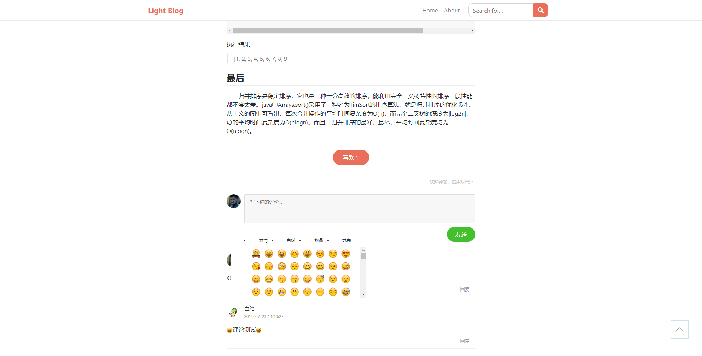
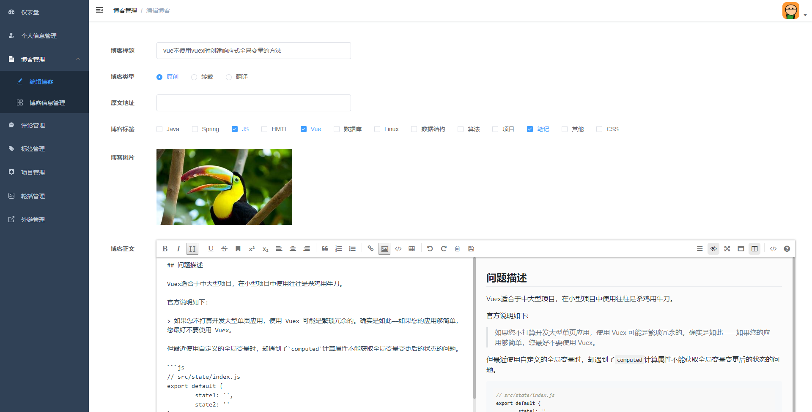
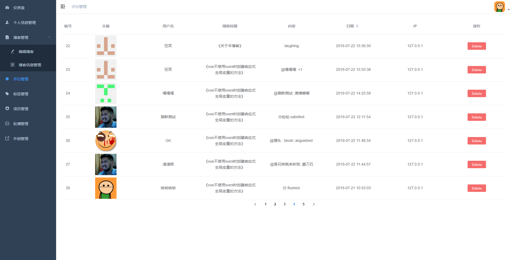
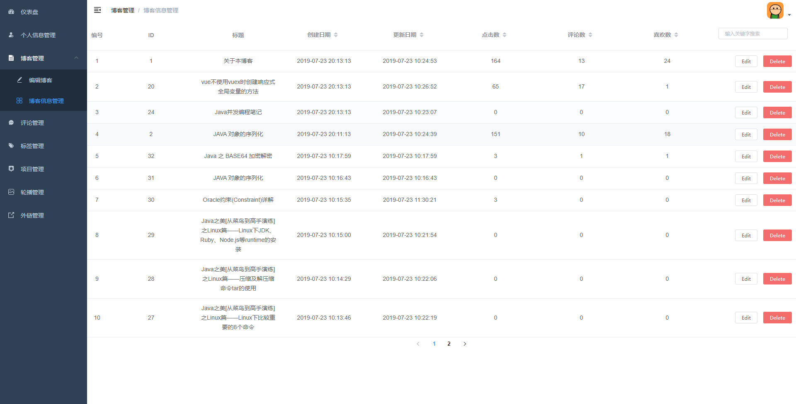

# light-blog-front

## 简介

Light Blog是一个前后端分离的轻量级个人博客系统，基于本人以前的同名项目[LightBlog](https://github.com/afkbrb/LightBlog)。

本博客系统由后台服务器系统(light-blog-back)、后台管理系统(light-blog-admin)、前端系统(light-blog-front)三个子系统组成。其中，后台服务系统基于SpringBoot，后台管理系统和前端系统均基于Vue。每个子系统的详细介绍可参看相应的Github地址。

## 预览地址

[2w6f8c.top](http://2w6f8c.top)

## 技术栈

vue-cli + bootstrap + element-ui + marked + hljs

## 传送门

- [后台服务系统(light-blog-back)](https://github.com/afkbrb/light-blog-back)
- [后台管理系统(light-blog-admin)](https://github.com/afkbrb/light-blog-admin)
- [前端系统(light-blog-front)](https://github.com/afkbrb/light-blog-front)
- [API](https://www.showdoc.cc/lightblog?page_id=2428180430024349)

## 截图

### 前台





### 后台








## 构建和运行

```bash
git clone git@github.com:afkbrb/light-blog-front.git
cd light-blog-front
# 国内建议使用cnpm install
npm install
# 需要运行light-blog-front
# run前可根据实际情况修改/config/dev.env.js和/config/prod.env.js中相关内容
npm run dev
# 访问地址: http://localhost:8080
# 打包
npm run build
```

## BlahBlah

如果本项目对您学习Vue或SpringBoot等有所帮助的话，请帮忙点颗⭐哦😁！

如果您对本项目有什么意见或建议，也欢迎批评指正。

